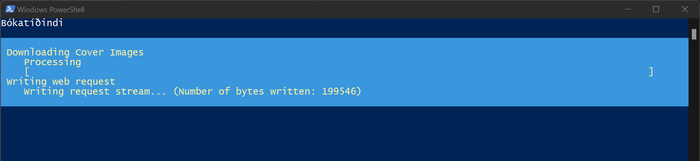
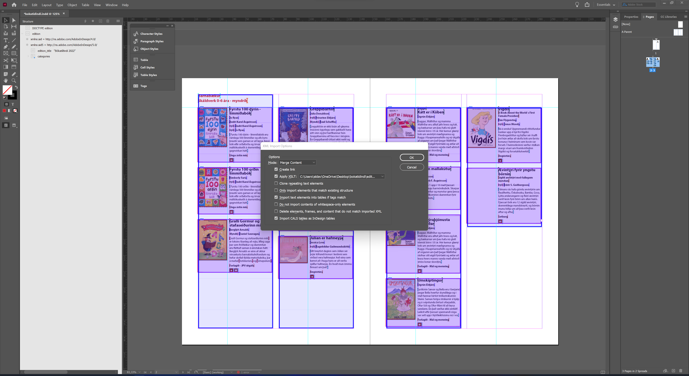

# Bokatidindi Print Preperation Process

Builds an InDesign print document for an annual Bokatidindi edition.

## The Process

1. Run the `edition.ps1` PowerShell script.
2. This takes a while, so grab a coffee.
3. Open the `bokatidindi.indd` file in Adobe InDesign after the script has stopped running.
4. In the File menu, choose Import XML and then pick the `edition.xml` file.
5. In the XML Import Options window, make sure to use *Merge Content* mode, *Create link* and to *apply the `edition.xsl` XSLT file*.
6. Importing a large collection of books does take a while, so now you can have another coffee if you want.
7. Then, find the InDesign *Structure* pane, expand the *edition* object and drag the *categories* object on to the first text column on page 2.

## Details About the Process

Running the edition.ps1 PowerShell script will:

1. Fetch the XML data for the current Bokatidindi print issue
2. Fetch the "print" variant of each image in that specific issue (this does take a while)
3. Remove Photoshop EXIF resolution data, which may conflict with the main resolution definition.

During the XML import into InDesign, this will happen:

InDesign will transform the XML data from `edition.xml` into a different XML data stream using the `edition.xsl` XSLT file, which resembles more closely how InDesign will render the data.

Newlines and the icons representing each "binding type" are defined in the XSLT file and if there is anything that you need to change and can't by using style sheet, then have a look at that one.

## InDesign script

This package provides an InDesign Extendscript file intended to automate the InDesign workflow and is run just after all the books have been imported.

It applies a style to book images, scales the binding icons by 40% and evens out each book table.

More information about script locations is at https://helpx.adobe.com/indesign/using/scripting.html.

## Caveats

### Prevent Time-Consuming Work Using XSLT

Instead of manually editing certain things en masse in the InDesign file, you may be able to change them by using XSLT file.

If those changes are meant to stay in future editions of Bokatidindi, make sure to create a pull request to this repository.

Information about InDesign's special markup is available at https://carijansen.com/indesign-xml-reference-guide/.

### Stylesheets in InDesign

The InDesign file has already specified the relevant styles for each XML element we use.

Please keep using InDesign stylesheets to ensure that any code is clean and that this process remains without undocumented gotchas.

### Binding Type Icons

Icons for each binding type are located in the assets directory as Adobe Illustrator file.

Those are also further defined in the `edition.xsl` file. (Look for `binding_types` in there to see how each binding type is represented by an .ai file.)

### Thumbnail Images

Image sizes and resolutions are hardcoded to have the maximum width of 300 px at 330 DPI in the [Bokatidindi source code](https://www.bokatidindi.is/FIBUT/bokatidindi/) and if the definition there is changed, a rake task needs to be run before retreiving the XML data again or the server will run out of memory.

## Contribute

If you change anything about the process, please make sure to update this readme file and other relevant files to reflecr those changes.

## Copyright and Legal

This package is licence under the EUPL 2.0 licence. See the [LICENCE](LICENCE) file for more information.
